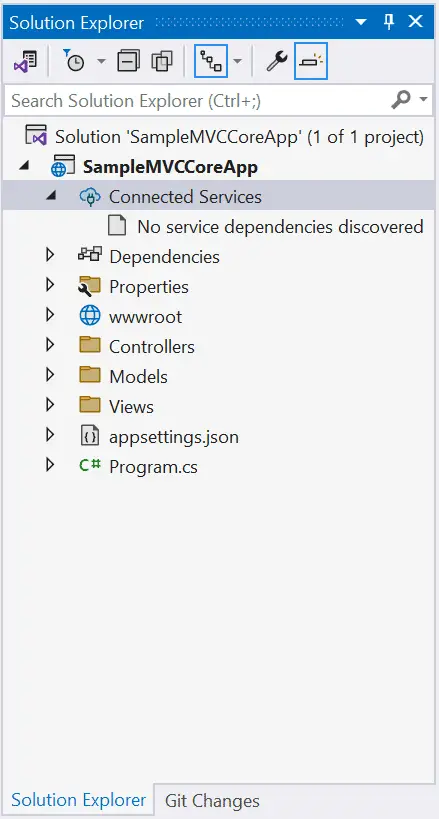
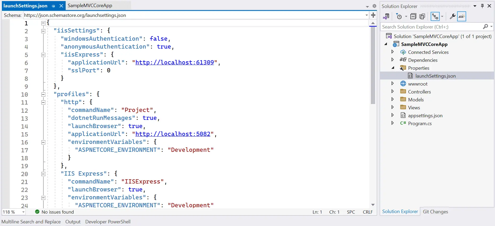
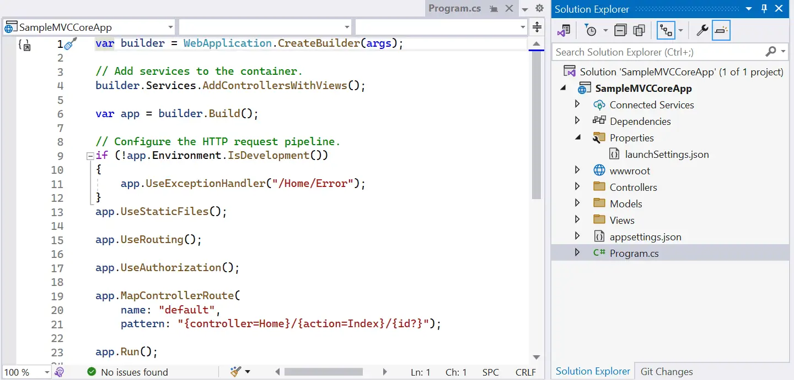

# Project Structure in .Net Core MVC

## Connected Services
The 'Connected Services' node contains the list of external services, APIs, and other data sources. It helps in the integration with various service providers, such as Azure, AWS, Google Cloud, and third-party services like authentication providers or databases. We are not using any service yet so it will be empty for now.

## Dependencies
The Dependencies node contains the list of all the dependencies that your project relies on, including NuGet packages, project references, and framework dependencies.

It contains two nodes, Analyzers and Frameworks.

<b> Analyzers </b> are extensions for static code analysis. They help you to enforce coding standards, identify code quality issues, and detect potential problems in your code. Analyzers can be custom rules or third-party analyzers provided by NuGet packages.

<b>Frameworks</b> node contains the target framework that your project is designed to run on. We have created an ASP.NET Core MVC application. So, it contains two frameworks, the .NET Core (Microsoft.NETCore.App) and ASP.NET Core (Microsoft.AspNetCore.App) framework. Click on any node and press F4 to see it's version, file path, etc.

You can expan each node to see all the assemblies it contains. In the future, whatever NuGet packages you install, all will be displayed under the dependencies node. So that you can uninstall it when you don't use it.

## Proparties
The Properties node includes launchSettings.json file which includes Visual Studio profiles of debug settings. launchSettings.json helps developers to configure the debugging and launch profiles of their ASP.NET (also known as ASP.NET Core) applications for different environments such as development, staging, production, etc.. The following is a default launchSettings.json file.

Note: The launchSettings.json file is only used by Visual Studio. After deploying the application, the launchSettings.json file is not used.  
Note: in profiles section, the IIS Express profile is used to run the application in IIS Express. The IIS Express is a lightweight and tiny version of IIS. It is used to run and test the application locally. The IIS Express is not used in production. The Kestrel profile is used to run the application in Kestrel web server. The Kestrel is a cross-platform web server that runs on Windows, Linux, and macOS. It is used to run the application in production.

## wwwroot
By default, the wwwroot folder in the ASP.NET Core project is treated as a web root folder. Static files can be stored in any folder under the web root and accessed with a relative path to that root.

All the css, JavaScript, and external library files should be stored here which are being reference in the HTML file.

## Controllers, Models, Views
The Controllers, Models, and Views folders include controller classes, model classes and cshtml or vbhtml files respectively for MVC application.

## Program.cs
The last file 'program.cs' is an entry point of an application. ASP.NET Core web application is a console application that builds and launches a web application.

The above program.cs file uses the top-level statements so when the application starts, it starts executing code from top to bottom.

Top-level statements in C# are a feature introduced in C# 9.0 to simplify the structure of your C# code by allowing you to write statements outside of traditional class and method definitions. With top-level statements, you can write C# code at the top level of a file without the need for a containing class or method.

## Reference: 
[TutorialSteacher](https://www.tutorialsteacher.com/core/aspnet-core-application-project-structure)