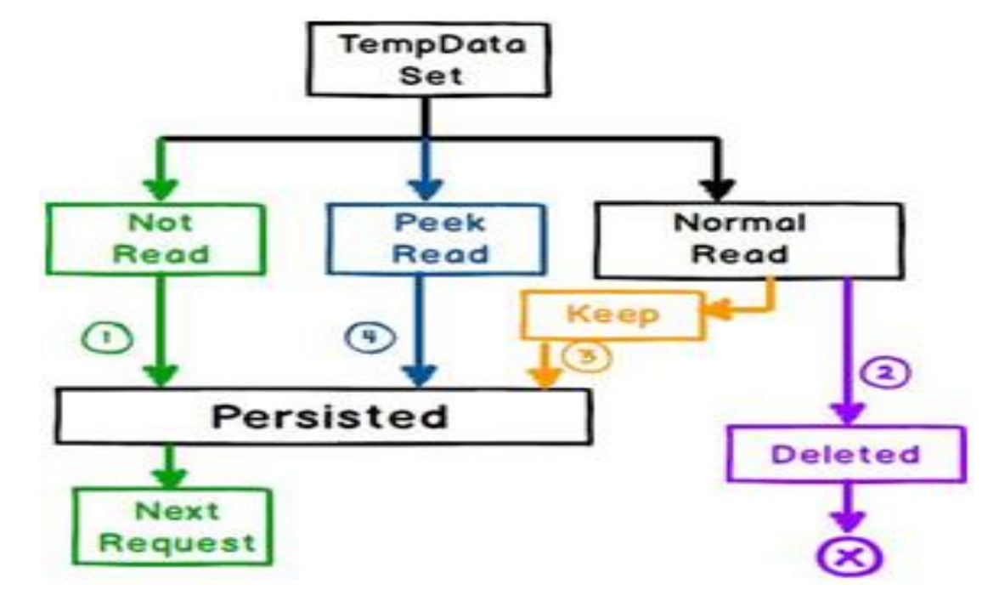

# Passing Data to view in MVC .Net Core

There are 3 ways to pass data from controller to view and from action to action in MVC .Net Core.

1. ViewBag
2. ViewData
3. TempData

## ViewBag

ViewBag is a dynamic property that takes advantage of the new dynamic features in C#. ViewBag enables you to dynamically share values from the controller to view. It is a wrapper around the ViewData.

### Example

```csharp
public IActionResult Index()
{
    ViewBag.Name = "Mohamed Ibrahim";
    ViewBag.Age = 25;
    return View();
}
```
### View

```html

<div class="text-center">
    <h1 class="display-4">Welcome @ViewBag.Name</h1>
    <p>Age: @ViewBag.Age</p>
</div>
```

## ViewData

ViewData is a dictionary of objects that is derived from ViewDataDictionary class and accessible using strings as keys. It is used to pass data from controller to corresponding view. It is derived from ViewDataDictionary class.

### Example

```csharp
public IActionResult Index()
{
    ViewData["Name"] = "Mohamed Ibrahim";
    ViewData["Age"] = 25;
    return View();
}
```
### View

```html

<div class="text-center">
    <h1 class="display-4">Welcome @ViewData["Name"]</h1>
    <p>Age: @ViewData["Age"]</p>
</div>
```

### Note: ViewData and ViewBag both use the <em> same dictionary </em> internally. So you cannot have ViewData Keymatches with the property name of ViewBag

## ViewModel (Strongly Typed View)

ViewModel is a class that contains the fields which are represented in the strongly typed view. It is used to pass data from controller to view. It is also used to validate data on the client side.

### Example

```csharp
public class EmployeeViewModel
{
    public string Name { get; set; }
    public int Age { get; set; }
}
```

```csharp
public IActionResult Index()
{
    EmployeeViewModel employeeViewModel = new EmployeeViewModel();
    employeeViewModel.Name = "Mohamed Ibrahim";
    employeeViewModel.Age = 25;
    return View(employeeViewModel);
}
```

### View

```html

<div class="text-center">
    <h1 class="display-4">Welcome @Model.Name</h1>
    <p>Age: @Model.Age</p>
</div>
```
### Note: The ViewData dictionary approach has the benefit of being fairly fast and easy to implement. Some developers don't like using string-based dictionaries, though, since typos can lead to errors that will not be caught at compile-time. The un-typed ViewData dictionary also requires using the "as" operator or casting when using a strongly-typed language like C# in a view template. 
ViewData & ViewBag it’s harming the Mvc-Pattern

## TempData

TempData is also a dictionary object derived from TempDataDictionary class and stored in short lives session. It is used to pass data from current request to subsequent request (means redirecting from one page to another). It is useful when you want to display message after redirecting.




### Example

```csharp
public IActionResult Index()
{
    TempData["Name"] = "Mohamed Ibrahim";
    TempData["Age"] = 25;
    return RedirectToAction("About");
}

public IActionResult About()
{
    ViewData["Name"] = TempData["Name"];
    ViewData["Age"] = TempData["Age"];
    return View();
}
```

### View

```html

<div class="text-center">
    <h1 class="display-4">Welcome @ViewData["Name"]</h1>
    <p>Age: @ViewData["Age"]</p>
</div>
```
Note: TempData is used to pass data from current request to subsequent request means from one page to another page. It will not be available after subsequent request. It’s life is very short and lies only till the target view is fully loaded.

## Limitations 
* Both ViewData & ViewBag does not provide compile 
time error checking
* Viewbag & viewdata not the best way to send data 
from controller to view
* So to pass data need to make Strong type view 
models because it provide compiler time error 
checking

# Session Data

Session is a mechanism to store data on server memory. It is used to store user specific data at server side. It is also used to pass data from one controller to other controller. It is used to store user specific data at server side. It is also used to pass data from one controller to other controller. It is used to store user specific data at server side. It is also used to pass data from one controller to other controller.

### State Management
The state can be stored using several approaches: 
* Cookies
* Query Strings
* Hidden Fields
* TempData
* Session State

## Session State

Session state is a process of storing user data at server side in Key/Value dictinary. It is used mainly in ASP.NET Webforms but also available in ASP.NET MVC.

The default time is 20 minutes (but can be configured if necessary).

This information is Store in a global storage that is accessible from all pages in the Web application per User.


Session management in ASP.NET Core is <span style="color:red"> not enabled </span>
by default.

To enable session, we need to add the following code in the ConfigureServices method of the Startup class.

<span style="color:red">Call UseSession after UseRouting and before
UseEndpoints</span>

```csharp
public void ConfigureServices(IServiceCollection services)
{
    services.AddSession();
}
public void Configure(IApplicationBuilder app, IHostingEnvironment env)
{
    app.UseSession();
}
```

### How to use Session in ASP.NET Core MVC

To write data in session, we use the following code.


```csharp
public IActionResult Index()
{
    HttpContext.Session.SetString("Name", "Mohamed Ibrahim");
    HttpContext.Session.SetInt32("Age", 25);
    return View();
}
```

to read data from session, we use the following code.
```csharp
public IActionResult About()
{
    ViewData["Name"] = HttpContext.Session.GetString("Name");
    ViewData["Age"] = HttpContext.Session.GetInt32("Age");
    return View();
}
```
## Cookies

Cookies are small text files that are stored in the client browser. It is used to store user specific data at client side. It is also used to pass data from one page to other page. 

### How to use Cookies in ASP.NET Core MVC

to write data in cookies, we use the following code.


```csharp
public IActionResult Index()
{
    CookieOptions option = new CookieOptions();
    option.Expires = DateTime.Now.AddMinutes(1);
    Response.Cookies.Append("Name", "Mohamed Ibrahim", option);
    Response.Cookies.Append("Age", "25", option);
    return View();
}
```
to read data from cookies, we use the following code.

```csharp
public IActionResult About()
{
    ViewData["Name"] = Request.Cookies["Name"];
    ViewData["Age"] = Request.Cookies["Age"];
    return View();
}
```
