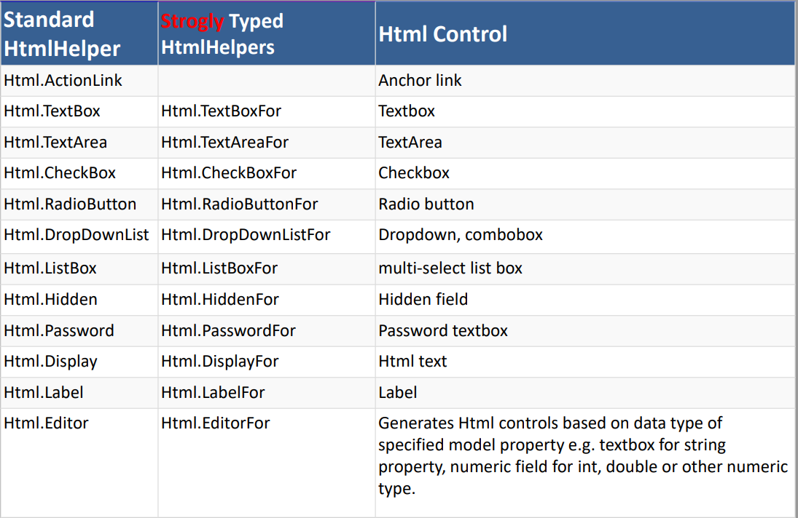

# HTML Helper MVC .NET Core

## Description
HTML Helpers in ASP.NET Core MVC are methods that simplify the generation of HTML markup within Razor views by encapsulating server-side logic. They provide a way to write C# code that generates HTML elements and attributes, making creating dynamic and interactive content in your web application easier. HTML Helpers has been a part of ASP.NET MVC since its earlier versions and continue to be available in ASP.NET Core MVC.

For example, if you want to generate a textbox with id=”firtsname” and name=”firtsname” then you can type all the required HTML in a view as shown below.

```html
<input type="text" id="firstname" name="firstname" />
```
But in ASP.NET Core MVC, you can use the TextBox HTML helper method to generate a text box.

```cshtml
@Html.TextBox("firstname")
```

The Point you need to keep in mind is several overloaded versions are available for the above TextBox HTML helper method. To set the value along with the name, you can use the following overloaded version of the TextBox helper method.

```html
@Html.TextBox("firstname", "John")
```

The above code will generate the following HTML.

```html
<input id="firstname" name="firstname" type="text" value="John" />
```

It is also possible to set the HTML attributes of a text box. If you want to do so, you need to use the following overloaded version of the TextBox HTML helper method.

```html
@Html.TextBox("firtsname", "Pranaya", new { style = "background-color:Red; color:White; font-weight:bold", title="Please enter your first name" })
```

Notice, here we are passing the HTML attributes title and style as an anonymous type to the TextBox helper method. Some of the HTML attributes are reserved keywords, for example, readonly, class, etc. If you want to use these attributes within a Helper method, you need to prefix them with the @ symbol, as shown in the example below.

```html
@Html.TextBox("firtsname", "Pranaya", new { @class = "redtextbox", @readonly="true" })
```


## HTML Helper Methods
The following table lists the commonly used HTML Helper methods.
### Note that you can use the strongly typed versions of these methods by prefixing the method name the word “For”. For example, the strongly typed version of the TextBox helper method is TextBoxFor.
```html
@Html.TextBoxFor(model => model.FirstName)
```



---

Notes
* You can use Display annotation to change the display name of a property.

```cs
[Display(Name = "First Name")]
public string FirstName { get; set; }
```

* EditorFor helper method is used to generate an HTML element based on the data type of the property. For example, if the property is of type string, then it will generate a text box. If the property is of type DateTime, then it will generate a date picker.

```html
@Html.EditorFor(model => model.DateOfBirth)
```

* DropDownListFor helper method is used to generate a drop-down list for a property.

```html
@Html.DropDownListFor(model => model.Country, new SelectList(ViewBag.Countries, "Value", "Text", Model.Country @* Selected Value *@), new { @class = "form-control" })
```

And so on...
-----------
# Tag Helpers in ASP.NET Core MVC
Tag Helpers enable server-side code to participate in creating and rendering HTML elements in Razor files. For example, the following HTML element is created using the anchor tag helper.

```html
<a asp-action="GetAll" asp-controller="Student">Get All</a>
```

The above code will generate the following HTML.

```html
<a href="/Student/GetAll">Get All</a>
```

The following table lists the commonly used Tag Helpers.
| Tag Helper | Description |
| --- | --- |
| a | Creates an anchor tag |
| form | Creates an HTML form |
| input | Creates an HTML input element |
| label | Creates an HTML label element |
| select | Creates an HTML select element |
| textarea | Creates an HTML textarea element |
| ul | Creates an HTML unordered list |
| li | Creates an HTML list item |

## Tag Helper Attributes
The following table lists the commonly used Tag Helper attributes.
| Attribute | Description |
| --- | --- |
| asp-action | Specifies the name of the action method |
| asp-controller | Specifies the name of the controller |
| asp-area | Specifies the name of the area |
| asp-for | Specifies the name of the model property |
| asp-items | Specifies the items to be displayed in a drop-down list |
| asp-route- | Specifies the route values |
| aps-route-{value} | Specifies the route value |

For more information, see [Tag Helpers in ASP.NET Core MVC](https://learn.microsoft.com/en-us/aspnet/core/mvc/views/working-with-forms?view=aspnetcore-6.0#the-select-tag-helper)
